# Minimal Webflow Development Typescript Template

This is a a bun-based Webflow integration project that enables TypeScript development for Webflow websites. The compiled code is hosted on a CDN and loaded into Webflow sites via custom code blocks.

We use cloudflare stable tunnel to route localhost code via https. This allows other people (designers, pm's, clients) to see the code changes in real time without deploying to prod.


_Development Mental Model_

## Purpose

- Provide a modern TypeScript development environment for Webflow projects
- Enable modular, maintainable code for Webflow sites
- Support page-specific and global features/interactions
- Integrate with GSAP for animations
- Integrate with Finsweet for list management (in case filtering is needed)

## Key Characteristics

- Code is built and hosted externally, then loaded into Webflow
- Uses data attributes (`data-page`, `data-menu-toggle`, etc.) to connect with Webflow elements

### Feature-Based Architecture

**Features** (`src/features/`):

- Self-contained interactive components or animations
- Organized in folders by scope: `global/`, `artists/`, `home/`, etc.
- Can be global (run on all pages) by setting `global: true`
- Must implement the `Feature` interface with `name`, `init()`
- Export as default
- Place in `features/global/` for global features, or `features/[page-name]/` for page-specific

**Pages** (`src/pages/`):

- Consolidate features for specific pages
- Must implement the `Page` interface with `name`, `features[]`, `init()`, and optional `destroy()`
- Page name matches `data-page` attribute on `<body>` element in Webflow
- Export as default

---

# Integration with Webflow

In Webflow, there are two possibilities:

In both cases, you have the HMR (Hot Module Reload) in place, it allows you to refresh the page each time you save a TS file. It's convenient and it will save you time.

- If you do both Webflow dev and TS:

  Paste this script into the `Before </body> tag` part of the Webflow custom code in the project settings so that it loads on all pages.

  ```html
  <script type="module" src="http://localhost:7777/@vite/client"></script>
  <script type="module" src="http://localhost:7777/src/main.ts"></script>
  ```

- If you are doing the TS dev but not the Webflow dev (**recommended version**):

      Paste this script in the `Before </body> tag` part of the Webflow custom code in the project settings so that it loads on all pages. We will change the url of Netlify later to load the production files.

  ```jsx
  <script>
  (function () {
    const TUNNEL_URL = 'https://your.cloudflared.tunnel.com'
    const PROD_URL   = 'https://my-project.vercel.app'

    const DEV_SCRIPTS  = [TUNNEL_URL + '/@vite/client', TUNNEL_URL + '/src/main.ts']
    const PROD_SCRIPTS = [PROD_URL + '/main.js']

    function createScripts(arr, isModule) {
      return arr.map(function (url) {
        const s = document.createElement('script')
        s.src = url
        if (isModule) s.type = 'module'
        return s
      })
    }

    function insertScripts(arr) {
      arr.forEach(function (s) { document.body.appendChild(s) })
    }

    // Probe the tunnel's vite client endpoint.
    // If it responds → dev mode, load tunnel scripts (incl. HMR over wss).
    // If it fails     → prod mode, load the built bundle from Vercel.
    fetch(DEV_SCRIPTS[0], { mode: 'no-cors' })
      .then(function () {
        insertScripts(createScripts(DEV_SCRIPTS, true))
      })
      .catch(function () {
        insertScripts(createScripts(PROD_SCRIPTS, false))
      })
  })()
  </script>
  ```
